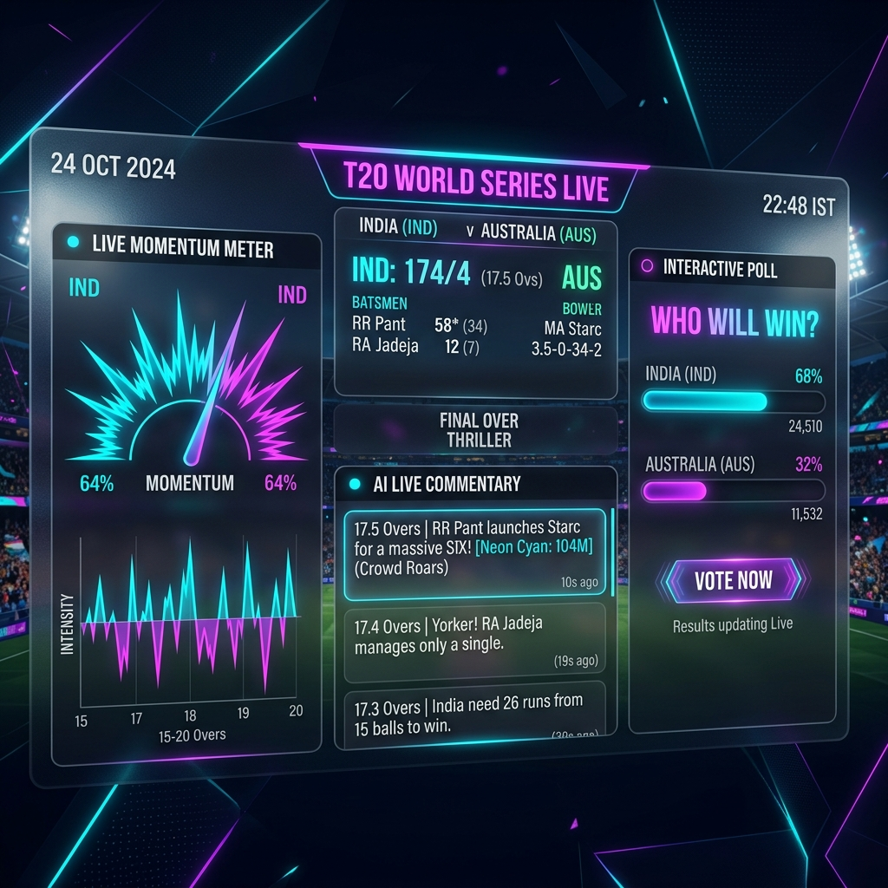
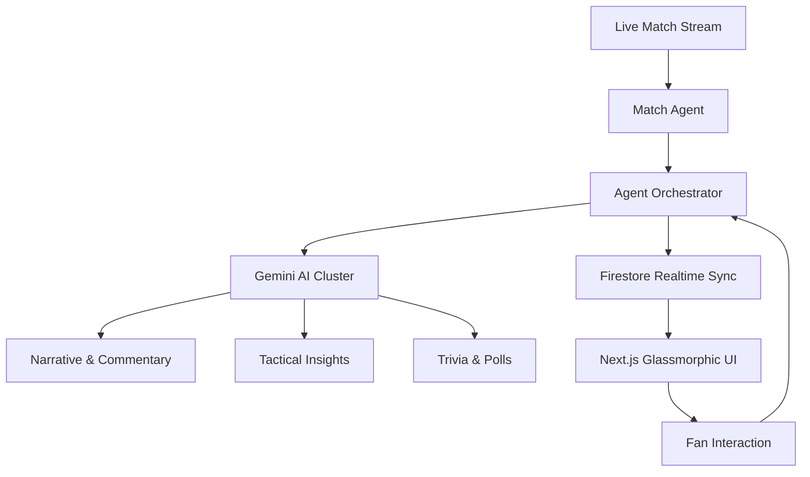

# 🚀 FanVerse AI

> **An AI-native realtime sports engagement operating system powered by autonomous multi-agent orchestration.** Built for Google Cloud — Build with AI (Agentic Premier League).



---

## 🏆 The Vision: Passive Watching → Interactive AI Experience

Modern sports viewing is passive. Fans watch matches but lack intelligent realtime interaction. **FanVerse AI** transforms the living room into a cinematic, interactive arena where **8 autonomous agents** collaborate to narrate, analyze, and engage fans in realtime.

---

## 🧠 Multi-Agent Orchestration (8 Agents Active)

Unlike traditional dashboards, FanVerse AI is a living ecosystem of agents:

1.  **Match Agent**: The eyes of the system. Detects critical events.
2.  **Narrative Agent (AI Director)**: Crafts cinematic storylines and emotional arcs.
3.  **Commentary Agent**: Generates situational, energetic commentary using **Gemini Pro**.
4.  **Prediction Agent**: Orchestrates real-time polls and win-probability shifts.
5.  **Insight Agent (Tactical AI)**: Acts as a Digital Captain, providing coach-level suggestions.
6.  **Social Agent**: Monitors crowd energy and generates "Reaction Storms."
7.  **Trivia Agent**: Launches dynamic quizzes based on live match history.
8.  **Engagement Agent**: Manages the XP economy, streaks, and achievement badges.

---

## ⚡ Technical Architecture (Agentic APL Stack)



---

## 🌟 Premium Features

*   🎭 **Cinematic Narrative**: A real-time emotional arc generated for every match.
*   🎮 **Live Play Mode**: Self-running demo engine designed for high-impact presentations.
*   🏆 **Achievement System**: Animated badges (Oracle, Legend, Streak King) with rarity-based glows.
*   📈 **Sports Intelligence**: Dynamic Win Probability and a "Pressure Index" that spikes during death overs.
*   📱 **ShareCard Engine**: Generate AI-powered match posters and highlights for X/Twitter.
*   🎤 **AI Journalism**: Professional match reports generated instantly after the final ball.

---

## 🚀 Scaling & Future Roadmap

*   **Fan Clans**: Community-driven viewing rooms with agent-led moderation.
*   **AR Stadium Mode**: Bringing the dashboard into the physical space via XR.
*   **Multi-Sport Support**: Expanding from Cricket to Football, Kabaddi, and Basketball.
*   **Voice Commentary**: AI-synthesized voices for a hands-free broadcast experience.

---

## 🏗 Tech Stack

| Layer | Technology |
| :--- | :--- |
| **Frontend** | Next.js 14, Tailwind CSS, Framer Motion |
| **Backend** | Python, FastAPI, Firebase Functions |
| **AI Engine** | Google Gemini Pro (Multimodal) |
| **Realtime** | Firestore Realtime Listeners |
| **Deployment** | Vercel (Frontend), GCP (Backend) |

---

## 🏁 Setup & Demo

### 1. Environment
Create a `.env` in the root:
```bash
GEMINI_API_KEY=your_key_here
```

### 2. Launching the Ecosystem
```bash
# Frontend
cd frontend && npm install && npm run dev

# Backend
cd backend && pip install -r requirements.txt && uvicorn api.index:app --reload
```

---

## 🏆 Built For
**Google Cloud — Build with AI (Agentic Premier League)**

FanVerse AI is more than a dashboard — it's the future of how humanity consumes live sports.

**Creator**: [Sai Kiran BK](https://linkedin.com/in/saikirantech)
