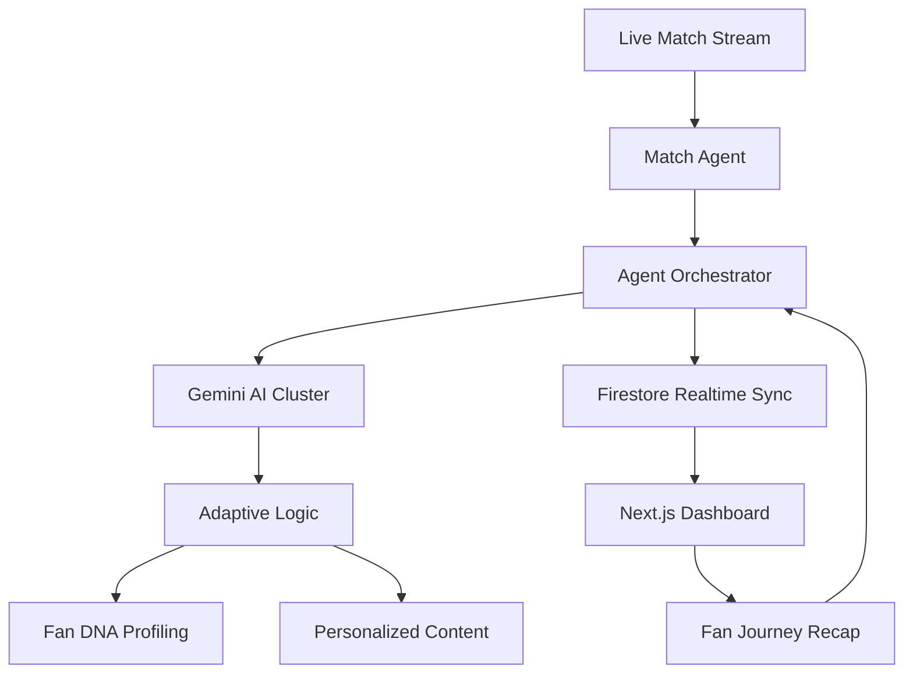

# 🚀 FanVerse AI — The AI-Native Gamified Sports OS

> **An AI-native gamified sports engagement ecosystem with adaptive fan progression.** Powered by autonomous multi-agent orchestration for the Google Cloud — Build with AI (Agentic Premier League) Challenge.

---

## 🎖️ Challenge 2 Focus: Gamification & Adaptive Behavior

FanVerse AI is a **behavior-driven progression system**. We use Gemini-powered agents to analyze fan behavior and adapt the entire experience—from difficulty levels to tactical suggestions—creating a "Fan DNA" that evolves every match.

---

## 🧠 Multi-Agent Orchestration (9 Agents Active)

Unlike traditional dashboards, FanVerse AI is a living ecosystem of agents:

1.  **Match Agent**: Detects critical live events.
2.  **Narrative Agent**: Crafts cinematic storylines and emotional arcs.
3.  **Commentary Agent**: Generates situational, energetic commentary.
4.  **Prediction Agent**: Orchestrates real-time polls and win-probability.
5.  **Insight Agent (Tactical AI)**: Acts as a Digital Captain.
6.  **Social Agent**: Monitors crowd energy and generates "Reaction Storms."
7.  **Trivia Agent**: Launches adaptive-difficulty quizzes.
8.  **Engagement Agent**: Manages the XP economy and streaks.
9.  **Behavior Agent (New)**: Analyzes fan behavior to build "Fan DNA."

---

## ⚡ Technical Architecture



---

## 🌟 Premium Features

*   🎭 **Fan DNA Profiling**: Adaptive user profiles that evolve based on your participation style.
*   🎮 **Season Passport**: A visual unlock tree for long-term achievement progression.
*   🏆 **Global Arena**: A high-impact leaderboard for fan clans and individuals.
*   🎤 **AI Journalism**: Professional match reports and personalized fan journey recaps.
*   📺 **Broadcast UX**: Skewed tickers, agent monitors, and real-time crowd power meters.

---

## 🏗 Tech Stack

| Layer | Technology |
| :--- | :--- |
| **Frontend** | Next.js 14, Tailwind CSS, Framer Motion |
| **Backend** | Python, FastAPI, Firebase Functions |
| **AI Engine** | Google Gemini Pro |
| **Realtime** | Firestore Realtime Listeners |

---

## 🏁 Setup & Demo

### 1. Environment
```bash
GEMINI_API_KEY=your_key_here
```

### 2. Launch
```bash
# Frontend
cd frontend && npm install && npm run dev

# Backend
cd backend && pip install -r requirements.txt && uvicorn api.index:app --reload
```
